# 03 Solution and PRD (light planner I3): budget-app / first-version

Inputs: request.md, 00-context.md (the latest answers win), 01-research-and-stories.md, 02-alternatives.md, 02-chosen.md (accepted by the user), 03-decisions.md (the user's decisions: four in I3, then 5 to 8 on the open issues and defaults), and the approved software architecture `~/Developing/.claude/runs/budget-app/first-version/architecture.md` (Status: approved, 2026-11-24; contracts 4 and 10 approved the same day for decisions 5 to 7).

The architecture's contracts, module boundaries and layer rules are copied into section 3 unchanged, so this plan stands on its own in the project repo. Anything the architecture doesn't settle goes through the architecture skill before it is built; section 12 lists the confirmed defaults.

The decisions, applied throughout (decisions 5 to 8 are in 03-decisions.md and in contracts 4 and 10):
1. Software architecture: "Approve as written".
2. Over-limit warning on the expense form: "Limit's own period". A $200/week Food limit is checked against the week that contains the expense's date, and the new expense is counted.
3. Build order: "Personal first, then sharing". 1) sign-up, sign-in, a personal budget and entries; 2) the dashboard with charts and the period picker; 3) limits; 4) shared budgets and invites, tested with alice and bob.
4. What proves sharing works: "API tests + one browser run". API tests cover every role and isolation case. One Playwright run in Chrome signs in alice and bob on `alice.localhost` and `bob.localhost`; alice invites bob, and bob accepts, sees the budget and can't edit it.

---

## 1. Problem

The user wants a simple budgeting app: users add income streams and expenses, expenses have categories, and a dashboard shows a donut chart (a pie with an empty centre) of current expenses against current income, plus line charts of income and expenses over time (request.md).

Since then, 00-context.md has set the scope:
- It is a POC that runs only on this Mac.
- Several made-up accounts sign in with email and password. Each user has a private budget and can create or join shared budgets.
- Entries can be one-off or recurring.
- Each budget has its own income and expense categories.
- Each category can have a spending limit, with its own period.
- A shared budget is edited by its creator and viewed by the members it invites.
- The user will test sharing by signing in as several fictitious accounts at the same time.

## 2. Solution architecture

The choice is Alternative A, adjusted (02-chosen.md section 4):
- the dashboard is computed on the server by a pure Python domain package;
- sessions are opaque tokens in a cookie, revoked on sign-out;
- standard-library `sqlite3` with numbered SQL migrations;
- two local processes: Vite and uvicorn;
- Recharts for both charts.

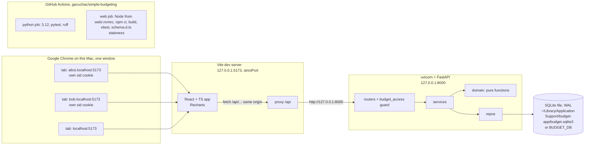
```mermaid
flowchart LR
    subgraph Chrome["Google Chrome on this Mac, one window"]
        TA["tab: alice.localhost:5173<br/>own sid cookie"]
        TB["tab: bob.localhost:5173<br/>own sid cookie"]
        TL["tab: localhost:5173"]
    end
    subgraph Vite["Vite dev server<br/>127.0.0.1:5173, strictPort"]
        SPA["React + TS app<br/>Recharts"]
        PX["proxy /api"]
    end
    subgraph API["uvicorn + FastAPI<br/>127.0.0.1:8000"]
        R["routers + budget_access guard"]
        S["services"]
        D["domain: pure functions"]
        RP["repos"]
    end
    DB[("SQLite file, WAL<br/>~/Library/Application Support/budget-app/budget.sqlite3<br/>or BUDGET_DB")]
    TA --> SPA
    TB --> SPA
    TL --> SPA
    SPA -->|"fetch /api/... same origin"| PX
    PX -->|"http://127.0.0.1:8000"| R
    R --> S
    S --> D
    S --> RP
    RP --> DB
    subgraph CI["GitHub Actions, gacuchac/simple-budgeting"]
        PJ["python job: 3.12, pytest, ruff"]
        WJ["web job: Node from web/.nvmrc, npm ci, build, vitest, schema.d.ts staleness"]
    end
```

| Concern | Decision | Evidence (02-chosen.md) |
| --- | --- | --- |
| Toolchain | `.venv` from `/opt/homebrew/bin/python3.12`; Node 26 + npm; `package-lock.json` committed; `web/.nvmrc` = 26 | S5-a held |
| Passwords | `pwdlib[argon2]`, `PasswordHash.recommended()` (argon2id). Rules checked on the server: at least 8 characters, 1 digit and 1 special character | S3-a, M6 held |
| Session | An opaque 32-byte token in cookie `sid`: `HttpOnly; SameSite=Lax; Path=/; Max-Age=34560000` (400 days), no `Secure`. The `sessions` table stores only its SHA-256. Sign-out deletes the row. There is no signing secret | S1-a, S8-a held; S1-b falsified |
| Several accounts at once | One `*.localhost` host per account in one Chrome window. Fallback: a throwaway Chrome profile per account | S2-d, S2-b held |
| Serving | Two processes: `uvicorn --host 127.0.0.1 --port 8000`, and Vite with `host: '127.0.0.1'`, `port: 5173`, `strictPort: true`, proxying `/api` to `http://127.0.0.1:8000`. No CORS middleware on the API | S6-a, S2-c fix, cors_probe |
| Database | Stdlib `sqlite3`. A connection factory sets `foreign_keys=ON`, `journal_mode=WAL` and `busy_timeout=5000`. Migrations are numbered `.sql` files tracked with `PRAGMA user_version`; table rebuilds are written by hand. Tests always use a `tmp_path` file | S7-b, B-2, S7-c held; S7-a batch trap avoided |
| Emails and invites | Own normaliser (strip, lower-case, regex). Invites are keyed by the normalised email | S4-b and invite matching held; S4-a, S4-c falsified |
| Charts | Recharts 3: a donut `Pie` with `innerRadius`; the red overflow mark is a thin second `Pie` sliver at the mark angle; a `LineChart` with two cumulative series | S9-a held (mark error 0 deg) |
| CI | Python job (3.12), plus a `web` job (`setup-node` from `web/.nvmrc`, `npm ci`, `npm run build`, `npx vitest run`) | S10-a held on GitHub's runner |
| Recurrence | Own `occurrences(rule, lo, hi)`, anchored on the rule's day, with month-end clamping. An edit splits the rule at a chosen date | M1-b held |
| Limits | Calendar-aware pro-rating per limit period, rounded once | M2-a held, M2-b falsified |
| Authorization | One FastAPI dependency, `budget_access(need)`. A test walks `app.openapi()["paths"]` to prove every budget route uses it | A-2 (fixed), A-3 held |

## 3. Software architecture (approved, copied from architecture.md)

This section is the approved design. Changing any contract in 3.3 goes through the `architecture` skill and the user's approval (workspace CLAUDE.md).

### 3.1 Layers and what each may depend on

```
web (React + TS)  --HTTP JSON-->  api  -->  services  -->  repos  -->  db
                                    \          |
                                     \--> auth  +--> domain (pure, no I/O)
```

- **domain**: pure functions only. No I/O, no clock, no database; "today" is always passed in. It depends on nothing.
- **db**: the connection factory and the migration runner. It knows SQL, but not the business rules.
- **repos**: one module per table group. Each function takes a `sqlite3.Connection`, and every function that touches budget data also takes a `BudgetAccess`. They return frozen dataclasses, never raw rows.
- **auth**: password hashing, password rules and sessions.
- **services**: compose repos and domain logic for one use case, such as building the dashboard, editing a recurring entry from a date, or accepting an invite.
- **api**: FastAPI routers, the pydantic request and response schemas, and the dependencies. They are thin: parse the request, call one service, map the result to a schema.
- **web**: talks only to `/api`, through a typed client. Its TypeScript types are generated from the API's OpenAPI schema and never written by hand.

A layer may depend only on layers below it. Nothing imports `api` except the app factory.

### 3.2 Python package layout (`budget_app/`)

| Module | Responsibility |
| --- | --- |
| `domain/money.py` | Cents are `int` everywhere: `format_usd(cents) -> str` |
| `domain/periods.py` | `PeriodSpec` (`Last(n, unit)` or `Range(start, end)`), `resolve(spec, today) -> DateRange` |
| `domain/recurrence.py` | `Rule` (`OneOff(date)`, `Every(n, unit, start, end)`, `MonthlyOnDay(day, start, end)`), `occurrences(rule, lo, hi) -> list[date]`, `split(rule, at, changes) -> tuple[Rule \| None, Rule]` (first is `None` when the rule is edited in place) |
| `domain/limits.py` | `LimitPeriod` (day, week, month or year), `period_containing(period, d) -> DateRange`, `prorate(limit_cents, period, rng) -> int`, `limit_status(limit, spent_cents, rng) -> LimitStatus` |
| `domain/dashboard.py` | `donut(income_cents, by_category) -> Donut`, `bucket_unit(rng)`, `cumulative(events, rng) -> list[Point]` |
| `domain/accounts.py` | `normalise_email(raw) -> str \| None`, `password_problems(pw) -> list[str]` |
| `db/connection.py` | `connect(path) -> sqlite3.Connection`, with foreign keys on, WAL mode and a busy timeout |
| `db/migrate.py` + `db/migrations/NNNN_*.sql` | `migrate(conn) -> int`, which applies the numbered SQL files and tracks progress with `user_version` |
| `repos/users.py`, `sessions.py`, `budgets.py`, `members.py`, `invites.py`, `categories.py`, `entries.py`, `limits.py` | Reads and writes for each table group |
| `auth/passwords.py` | `hash_password`, `verify_password` (pwdlib argon2id) |
| `auth/sessions.py` | `start(conn, user_id) -> token`, `resolve(conn, token) -> UserId \| None`, `end(conn, token)`. Only SHA-256 hashes of tokens are stored |
| `services/*.py` | One module per use-case group: accounts, budgets, sharing, entries, limits, dashboard. `services/limits.check(conn, access, category_id, on, amount_cents, exclude_entry_id) -> LimitStatus \| None` backs contract 10 |
| `api/app.py` | `create_app(db_path) -> FastAPI` |
| `api/deps.py` | `current_user`, `budget_access(need: "view" \| "edit") -> BudgetAccess` |
| `api/routers/*.py`, `api/schemas.py` | HTTP routes and their pydantic schemas |
| `seed.py` | `python -m budget_app.seed --reset --db PATH` |

### 3.3 Contracts that everything else depends on

These are the stable contracts. Changing any of them later goes through the architecture skill.

1. **Money** is an integer number of cents (USD) in Python, SQL and JSON. There are no floats anywhere.
2. **Dates** are ISO `YYYY-MM-DD`, with no time or time zone. The server works out "today" in the Mac's local zone and passes it into `domain`.
3. **Entry** (income or expense):
   `{id, budget_id, kind: "income"|"expense", name, amount_cents, category_id|null, source|null, rule}`
   `rule` is one of these shapes:
   - `{type:"one_off", date}`
   - `{type:"every", n, unit:"day"|"week"|"month", start, end|null}`
   - `{type:"monthly_on_day", day:1..31, start, end|null}`. Day 31 falls back to the last day of shorter months.

   `source` is set only on income entries. Both kinds have categories, and each budget has its own category set for each kind, seeded with defaults.
4. **Editing an entry.**
   - A one-off entry is edited in place with `PUT /api/budgets/{budget_id}/entries/{entry_id}` and the full entry body. A split on a one-off entry gives 422.
   - A recurring entry is edited from a date with `POST /api/budgets/{budget_id}/entries/{entry_id}/split {at, changes}`, which needs `edit` access.
     - If `at` is after the rule's `start`, the old rule ends on `at - 1 day` and a new entry with the changes starts on `at`. Both writes happen in one transaction. Earlier occurrences never change.
     - If `at` is on or before the rule's `start`, the whole series is updated in place: the same entry id gets the changes, and `start` stays as it was unless `changes` sets it.
     - If `at` is after the rule's `end`, the route gives 422.
     - The response is `{previous: Entry | null, current: Entry}`. `previous` is the old entry, now ending on `at - 1`; it is `null` after an in-place update. `current` is the entry that applies from `at`.
5. **Limit**: `{id, budget_id, category_id, amount_cents, period:"day"|"week"|"month"|"year"}`. A `LimitStatus` for a range is `{limit_id, category_id, allowed_cents (pro-rated by calendar), spent_cents, over: bool}`.
6. **Period** (query string): `?last=3&unit=month`, or `?start=YYYY-MM-DD&end=YYYY-MM-DD`. Both ends are inclusive.
7. **Dashboard** `GET /api/budgets/{id}/dashboard?<period>` returns:
   `{range, income_cents, expense_cents, donut:{total_cents, slices:[{category_id,name,amount_cents}], remaining_cents, mark_cents|null}, lines:{unit, points:[{date, income_cum, expense_cum}]}, limits:[LimitStatus]}`.
   `mark_cents` is the income total and is set only when expenses exceed income. It can be 0. Colours are chosen in `web`, not in the API.
8. **Access**: `BudgetAccess{budget_id, user_id, role:"editor"|"viewer", is_personal}`.
   - A non-member gets **404**. A viewer who tries to write gets **403**.
   - Every route under `/api/budgets/{budget_id}` must depend on `budget_access`. A test walks `app.openapi()` to prove it.
   - A personal budget can't be shared. The creator of a shared budget deletes it rather than leaving it. The creator can revoke any invite; a viewer can revoke only the invites they sent.
9. **Session**: the cookie `sid` is `HttpOnly` and `SameSite=Lax`, with a 400-day `Max-Age` and no `Secure` flag. Every non-auth route returns 401 without a valid session.
10. **Limit check** for the expense form: `GET /api/budgets/{budget_id}/limits/check?category_id=&date=&amount_cents=[&exclude_entry_id=]` returns `{status: LimitStatus | null}`.
    - It needs `view` access, so a non-member gets 404.
    - Its range is the limit's own calendar period containing `date`: the day itself, the Monday-to-Sunday week, the calendar month or the calendar year. So `allowed_cents` is the limit's `amount_cents`.
    - `spent_cents` is the sum of the category's expense occurrences in that range, leaving out the entry `exclude_entry_id` if it is one of them, plus `amount_cents`.
    - `over` is `spent_cents > allowed_cents`. `status` is `null` when the category has no limit.
    - It gives 422 when `category_id` isn't an expense category of this budget, `exclude_entry_id` isn't an entry of this budget, `amount_cents` is negative, or `date` isn't ISO.
    - For a recurring expense, the web passes the rule's `start` as `date`, and the amount is counted once.

### 3.4 Front end (`web/`)

- `src/api/schema.d.ts` is generated by `openapi-typescript` from the API's `/openapi.json`, and committed. A CI check fails when it is stale, so an API change breaks the front-end build instead of failing at runtime.
- `src/api/client.ts` is a thin typed `fetch` wrapper, and the only place that calls `fetch`.
- Each page reads data only through hooks in `src/hooks/`.
- The chart components are presentational:
  - `DonutChart({donut, colours})` draws the red mark at `mark_cents`.
  - `LineChart({lines})` draws the two cumulative lines.
  - `PeriodPicker` lets the user pick "last N days, weeks, months or years", or a calendar start and end.
- The expense form calls contract 10 through a `useLimitCheck` hook when the category, date or amount changes, and shows the over-limit warning when `status.over`. The warning never stops the save (decisions 2 and 5).

### 3.5 Tests (from architecture.md section 8)

- **`domain`:** table-driven unit tests, starting with the spike's 17 recurrence cases and the M2 to M4 fixtures.
- **`repos` and `services`:** tests against a `tmp_path` SQLite file.
- **`api`:** tests through `TestClient`, including the guard walk and the role matrix (viewer, editor, non-member).
- **Contract 4:** split after, on and before the start; 422 after `end` and on a one-off; `PUT` on a one-off. **Contract 10:** the US-17 fixtures, `exclude_entry_id`, no limit gives `null`, a foreign category gives 422, and the route-order test. **domain:** `period_containing` for each period, including a Sunday, Feb 29 2028 and Dec 31.
- **`web`:** Vitest for the hooks and the chart props, and one Playwright end-to-end run with two accounts.

### 3.6 Data model (derived, not a contract)

This is the table shape the spikes ran (`spikes/sqlite/schema.sql`, `spikes/authz/app.py`), plus what the contracts above need. The decomposer of each task owns the exact columns. The ON DELETE rules and CHECKs below are what the schema test (B-2 / S7) must find in `sqlite_master` after every migration.

| Table | Key rules | Added by |
| --- | --- | --- |
| `users` | `email` unique, stored normalised; `pw_hash` | `0001` (bud-01) |
| `sessions` | `token_hash` primary key; `user_id` ON DELETE CASCADE | `0001` |
| `budgets` | `kind` CHECK in (`personal`, `shared`); `created_by` | `0001` |
| `memberships` | PK (`budget_id`, `user_id`); `role` CHECK in (`editor`, `viewer`); budget ON DELETE CASCADE | `0001` |
| `categories` | `budget_id` ON DELETE CASCADE; `kind` CHECK in (`income`, `expense`); UNIQUE (`budget_id`, `kind`, `name`) | `0001` |
| `entries` | `budget_id` ON DELETE CASCADE; `category_id` ON DELETE **SET NULL** ("Uncategorized"); `kind` CHECK; `amount_cents` CHECK > 0; rule columns with a CHECK on `rule_type` | `0001` |
| `limits` | `category_id` UNIQUE, ON DELETE CASCADE (one limit per category); `period` CHECK in (`day`, `week`, `month`, `year`); `amount_cents` CHECK > 0 | `0002` (bud-10) |
| `invites` | `budget_id` ON DELETE CASCADE; normalised `email`; `invited_by`; `status` | `0003` (bud-12) |

Default categories, seeded whenever a budget is created (spike M7). Expense: Housing, Food, Transport, Utilities, Health, Entertainment, Other. Income: Salary, Freelance, Other.

## 4. User stories and acceptance criteria

Story ids keep their step-1 numbers. Stories US-16 to US-19 are new, split out of the answers given since step 1. Every criterion is meant to become a test: pytest through `TestClient` unless it says Vitest or Playwright.

Personas:
- **User**: any signed-in made-up account.
- **Creator**: the user who created a shared budget; the only editor of it.
- **Viewer**: a user who accepted an invite to a shared budget.
- **Tester**: the person running the POC with fictitious accounts.

### Phase 1: accounts, personal budget, entries

**US-01 Sign up.** As a visitor, I create an account with an email address and a password, so I get my own space.
- `POST /api/signup` with ` Alice@Example.Test ` and `abcdefg1!` returns 201, sets `sid`, and stores the email as `alice@example.test`.
- A second sign-up with the same email in any case or with extra spaces returns 409.
- `abcdefgh` (no digit), `abcdefg1` (no special character) and `ab1!` (too short) are each rejected with 422, which names the broken rule(s).
- `alice`, `alice@`, `@x.com`, `a b@x.com` and `alice@example` are rejected with 422. `bob@team.local` and `carol@demo.localhost` are accepted.
- The stored `pw_hash` starts with `$argon2id$`. The plaintext password appears nowhere in the database file.
- Right after sign-up, `GET /api/budgets` lists exactly one budget for the user: personal, role `editor`. It has the 7 default expense categories and the 3 default income categories.

**US-02 Sign in, stay signed in, sign out.** As a user, I sign in and stay signed in until I sign out, so only I can reach my data.
- Signing in with the right password returns 200 and a `sid` cookie that is `HttpOnly`, `SameSite=Lax` and `Max-Age=34560000`, with no `Secure` flag.
- A wrong password and an unknown email both return 401 with the same body.
- `GET /api/me` returns 200 with the user's email. Without a cookie it returns 401.
- After `POST /api/signout`, replaying the old `sid` returns 401.
- The `sessions` table holds only a 64-character SHA-256 hex string per session, never the token itself.
- A session still works after the app is recreated on the same database file (an API restart).
- A test walks the OpenAPI paths: every route except sign-up and sign-in returns 401 without a session.

**US-03 Isolation.** As a user, I never see or change a budget I'm not a member of.
- A test walks `app.openapi()["paths"]`. Every path under `/api/budgets/{budget_id}` returns 404 for a non-member on every method. Adding an unguarded budget route in the test makes the walk fail.
- A viewer gets 403 on every write method under the budget, and 2xx on every read.
- An entry, category or limit id that belongs to budget Y, used under budget X's path by a member of X only, returns 404.
- No budget-scoped route sets `include_in_schema=False`. A test checks this.

**US-04 Income streams.** As a user, I add, edit and delete income in the selected budget: one-off or recurring, with a source and an income category.
- `POST /api/budgets/{id}/entries` with `kind: "income"`, `amount_cents` greater than 0, `name`, `source`, an income `category_id` and any rule shape returns 201. The entry is listed by `GET .../entries`.
- `amount_cents` that is 0, negative or not an integer returns 422.
- An expense category, or a category from another budget, returns 422.
- A one-off entry can be edited in place and deleted. A deleted entry no longer appears in the list or on the dashboard.
- Web (Vitest): the amount field turns `1234.5` into `123450` cents without floating-point arithmetic, and rejects more than two decimals.

**US-05 Expenses.** As a user, I add, edit and delete expenses in the selected budget, one-off or recurring, each with an expense category or none.
- The same as US-04 with `kind: "expense"`. `category_id` may be null and then shows as "Uncategorized".
- A non-null `source` on an expense returns 422.

**US-16 Recurring entries and editing from a date.** As a user, I make an entry repeat every N days, weeks or months, or on a fixed day of the month, and I change it from a chosen date onward.
- Rules are validated: `n` of at least 1, `day` from 1 to 31, and `end` not before `start` (422 otherwise).
- Domain golden table (the spike's 17 cases): a rule on day 31 gives Jan 31, Feb 28 (Feb 29 in 2028), Mar 31 and Apr 30. Every 2 weeks works across both range edges. The end date is included. A rule that starts before the range is counted only inside it.
- `POST /api/budgets/{id}/entries/{entry_id}/split {at, changes}`:
  - the old entry's rule ends on `at - 1 day`;
  - a new entry with the changes starts at `at`;
  - with `at` on or before the rule's start, the same entry id is updated in place and `previous` is `null`;
  - with `at` after the rule's end, or on a one-off entry, it returns 422;
  - dashboard totals for any range ending before `at` are identical before and after the split.
- The split is atomic. If the second write fails (injected in the test), the original entry is unchanged and no new entry exists.
- Deleting a recurring entry removes the whole series.

**US-06 Categories.** As a user, I see each budget's default income and expense categories, and I add, rename and delete them.
- Adding or renaming to a name that already exists for the same budget and kind returns 409. The same name is allowed in another budget, or for the other kind.
- Deleting a category sets its entries' `category_id` to null. They show as "Uncategorized" in lists and on the donut, their amounts are unchanged, and the limit on that category is deleted.
- Categories of other budgets are untouched.

**US-14 Switch budgets (phase 1 part).** As a user, I pick the budget I'm working in from a switcher on every page.
- `GET /api/budgets` returns each budget with `kind`, `role` and `name`.
- Web: the switcher lists the personal budget. Choosing a budget reloads the entries, categories and dashboard for that budget id. The rest of this story is in phase 4.

### Phase 2: dashboard

**US-08 Period picker.** As a user, I pick "last N days, weeks, months or years", or a calendar start and end, and every figure and chart on the dashboard uses it.
- `?last=3&unit=month` and `?start=2026-01-01&end=2026-03-31` are both accepted. The response's `range` shows the resolved inclusive dates.
- `n` below 1, an unknown unit, `end` before `start`, both forms at once, or a malformed date each return 422.
- Web (Vitest): changing the picker issues one dashboard request with the new query, and the donut, the lines and the limit list all render from that one response.

**US-09 Donut chart.** As a user, I see a donut of the period's expenses by category, against the period's income.
- Domain fixtures (M3):
  - income 5,000 and expenses 3,000 give `total_cents` 5,000, `remaining_cents` 2,000 and `mark_cents` null;
  - income 3,000 and expenses 4,000 give `total_cents` 4,000, `remaining_cents` 0 and `mark_cents` 3,000;
  - income 0 and expenses 4,000 give `mark_cents` 0;
  - equal income and expenses give no mark and `remaining_cents` 0;
  - zero income and zero expenses give the empty state;
  - the slices always sum to the expense total, in cents.
- A recurring expense counts once for each occurrence in the range. Uncategorized expenses form one slice with `category_id` null.
- Playwright in Chrome: the over-income case puts the red mark at 270 deg, within 1 deg. The zero-income case puts it at 0 deg. The empty case shows the empty-state text. There are no console errors or warnings.
- Each category keeps the same colour across reloads (colour picked in `web` from the category id).

**US-10 Line chart.** As a user, I see one chart with two cumulative lines, income and expenses, over the period.
- Bucket unit: daily up to 62 days, weekly up to 1 year, monthly beyond that. Any range up to 10 years gives at most 121 points.
- The last point's `income_cum` and `expense_cum` equal the response's `income_cents` and `expense_cents`.
- Web: the chart renders exactly 2 line paths, and an empty range shows the empty state with no console error.

### Phase 3: limits

**US-07 Limits.** As a user, I set or clear a spending limit on an expense category, with its own period (day, week, month or year).
- `PUT` a limit on an expense category with `amount_cents` greater than 0 and a period returns 200. Setting it again replaces it, since there is one limit per category. `DELETE` clears it.
- A limit on an income category, or a category from another budget, returns 422 or 404.
- Deleting the category deletes its limit.

**US-11 Limit status on the dashboard.** As a user, I see which categories are over their limit in the chosen period.
- Pro-rating (M2-a fixtures):
  - a 50,000-cent monthly limit gives `allowed_cents` 50,000 for every full calendar month, February included;
  - a weekly limit gives exactly the limit for a full Monday-to-Sunday week;
  - a 3-month range gives the sum of the three months' pro-rated amounts, rounded once.
- `over` is true exactly when `spent_cents` is greater than `allowed_cents`. There is no "near limit" state.
- Web: only categories that are over show the marker on the dashboard. Viewers see limits and markers too.

**US-17 Over-limit warning on the expense form (decision 2).** As a user, entering an expense shows a warning when it would push its category over the limit in the limit's own period.
- Food has a $200/week limit and $150 is already spent in the week of Wed 2026-11-25 (Mon 23 to Sun 29). A new $60 expense dated 2026-11-25 shows the warning; a $40 one doesn't.
- An expense dated in the following week is checked against that week only.
- The check uses the same `LimitStatus` shape and pro-rating as the dashboard.
- The warning shows on the form, but doesn't stop the expense being saved (default; see section 12).
- The form gets its `LimitStatus` from contract 10 (decision 5):
  - no limit on the category gives `status: null` and no warning;
  - editing an expense passes `exclude_entry_id`, so its old amount isn't counted twice;
  - a category from another budget gives 422, and a non-member gets 404.

### Phase 4: sharing

**US-12 Create a shared budget.** As a user, I create a named shared budget and become its creator, the only editor.
- `POST /api/budgets {name}` returns 201 with `kind: "shared"` and `role: "editor"`. The new budget has its own default categories, and it appears in `GET /api/budgets`.

**US-13 Invite by email.** As any member of a shared budget, I invite someone by email. The invite waits until an account with that email signs in.
- Any member, editor or viewer, can `POST /api/budgets/{id}/invites {email}`. It returns 201, and the invite is pending with the normalised email.
- Inviting to a personal budget returns 409. A second pending invite to the same email for the same budget returns 409, and so does an invite to an existing member.
- `GET /api/budgets/{id}/invites` lists the budget's pending invites, with who sent each one.
- Revoking:
  - the creator can revoke any pending invite;
  - a viewer can revoke only the invites they sent, and gets 403 for the others;
  - a revoked invite disappears for the invitee.
- No email is sent.

**US-18 Accept or decline an invite.** As an invited user, I see my pending invites when I sign in, and I accept or decline each one.
- An invite to `ALICE2@Example.Test`, made before that account exists, appears in `GET /api/invites` after sign-up as ` Alice2@example.TEST`.
- Accepting makes the user a viewer: the budget appears in `GET /api/budgets` with `role: "viewer"`. Declining removes the invite from their list.
- A user can't accept or decline an invite addressed to another email (404). Accepting a revoked invite fails (404 or 409).
- Web: pending invites show right after sign-in, with Accept and Decline.

**US-14 Switch budgets and roles (phase 4 part).** As a member, I switch between my personal budget and each shared budget. The creator edits, and viewers can only view.
- A viewer can read the shared budget's entries, categories, limits and dashboard (200 on each), and gets 403 on every write.
- Web: in a budget where the user is a viewer, every add, edit and delete control is hidden or disabled. The switcher shows the role.
- Alice adds an expense to the shared budget, and bob sees it after a reload.

**US-19 Leave or delete a shared budget.** As a viewer, I leave a shared budget. As its creator, I delete it.
- When a viewer leaves (204), they get 404 on the budget from then on.
- The creator gets 409 on leave, and 204 on delete. After delete, every member gets 404, and no orphan rows remain (`LEFT JOIN` checks on entries, categories, limits, memberships and invites).
- A personal budget can't be left, deleted or shared (409).

### POC testing

**US-15 Several made-up accounts at once.** As the tester, I sign in as several fictitious accounts at the same time on this Mac, and I can reset to demo data.
- In one Chrome window, `alice.localhost:5173` and `bob.localhost:5173` are signed in as different users at the same time, and each `/api/me` returns its own email. No `/etc/hosts` edit is needed.
- `lsof` shows ports 8000 and 5173 bound to `127.0.0.1` only.
- `python -m budget_app.seed --reset --db PATH` (or `BUDGET_DB`) refuses to run without a database path. It creates alice, bob and carol `@example.com` with password `Password1!`:
  - each user gets a personal budget with sample entries, one-off and recurring;
  - a shared "Household" budget has alice as editor, bob as viewer and a pending invite for carol.
  - Running it twice gives the same row counts.
- The README documents the two run commands, the `*.localhost` tabs, and the throwaway-profile fallback.

## 5. Process flow per user story

### US-01 Sign up
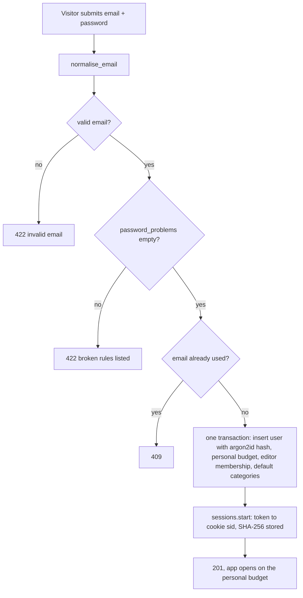
```mermaid
flowchart TD
    A["Visitor submits email + password"] --> B["normalise_email"]
    B --> C{"valid email?"}
    C -->|no| E1["422 invalid email"]
    C -->|yes| D{"password_problems empty?"}
    D -->|no| E2["422 broken rules listed"]
    D -->|yes| F{"email already used?"}
    F -->|yes| E3["409"]
    F -->|no| G["one transaction: insert user with argon2id hash, personal budget, editor membership, default categories"]
    G --> H["sessions.start: token to cookie sid, SHA-256 stored"]
    H --> I["201, app opens on the personal budget"]
```

### US-02 Sign in, stay signed in, sign out
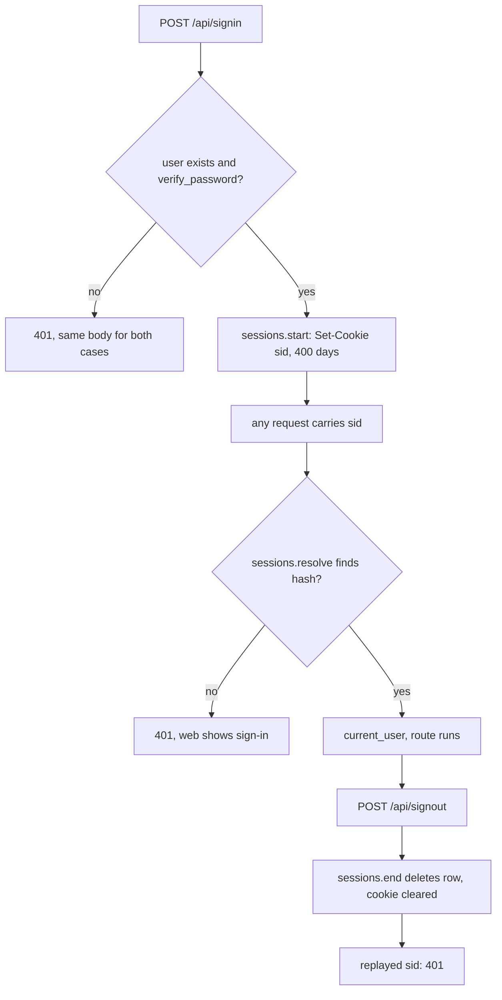
```mermaid
flowchart TD
    A["POST /api/signin"] --> B{"user exists and verify_password?"}
    B -->|no| E["401, same body for both cases"]
    B -->|yes| C["sessions.start: Set-Cookie sid, 400 days"]
    C --> D["any request carries sid"]
    D --> F{"sessions.resolve finds hash?"}
    F -->|no| G["401, web shows sign-in"]
    F -->|yes| H["current_user, route runs"]
    H --> I["POST /api/signout"]
    I --> J["sessions.end deletes row, cookie cleared"]
    J --> K["replayed sid: 401"]
```

### US-03 Isolation
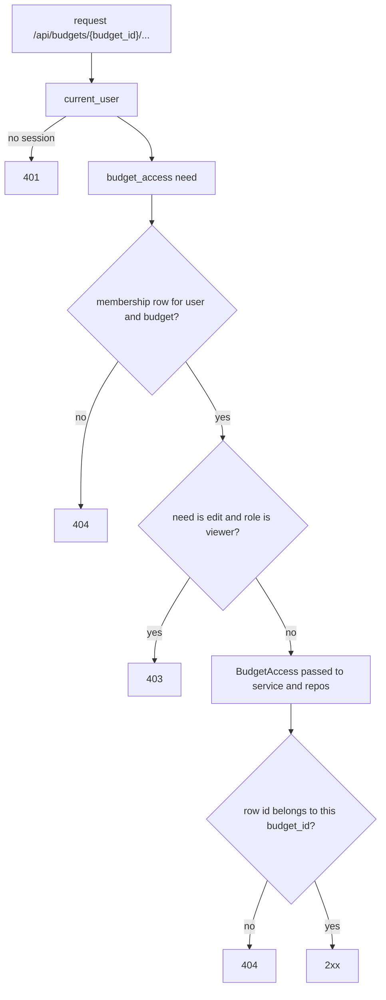
```mermaid
flowchart TD
    A["request /api/budgets/{budget_id}/..."] --> B["current_user"]
    B -->|no session| E0["401"]
    B --> C["budget_access need"]
    C --> D{"membership row for user and budget?"}
    D -->|no| E1["404"]
    D -->|yes| F{"need is edit and role is viewer?"}
    F -->|yes| E2["403"]
    F -->|no| G["BudgetAccess passed to service and repos"]
    G --> H{"row id belongs to this budget_id?"}
    H -->|no| E3["404"]
    H -->|yes| I["2xx"]
```

### US-04 Income streams
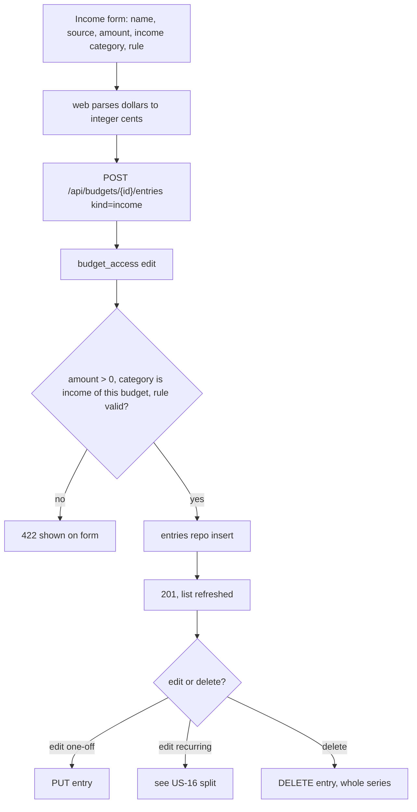
```mermaid
flowchart TD
    A["Income form: name, source, amount, income category, rule"] --> B["web parses dollars to integer cents"]
    B --> C["POST /api/budgets/{id}/entries kind=income"]
    C --> D["budget_access edit"]
    D --> E{"amount > 0, category is income of this budget, rule valid?"}
    E -->|no| X["422 shown on form"]
    E -->|yes| F["entries repo insert"]
    F --> G["201, list refreshed"]
    G --> H{"edit or delete?"}
    H -->|edit one-off| I["PUT entry"]
    H -->|edit recurring| J["see US-16 split"]
    H -->|delete| K["DELETE entry, whole series"]
```

### US-05 Expenses
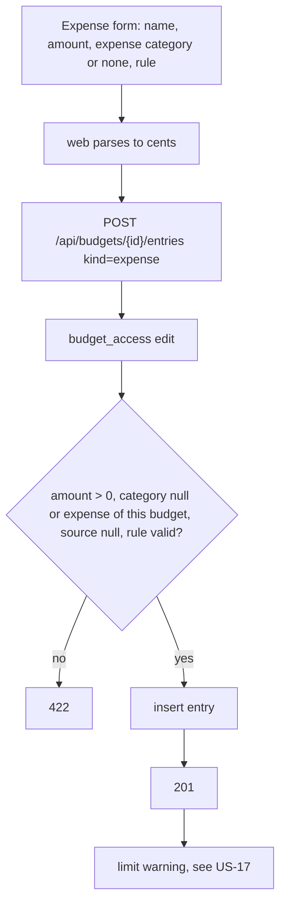
```mermaid
flowchart TD
    A["Expense form: name, amount, expense category or none, rule"] --> B["web parses to cents"]
    B --> C["POST /api/budgets/{id}/entries kind=expense"]
    C --> D["budget_access edit"]
    D --> E{"amount > 0, category null or expense of this budget, source null, rule valid?"}
    E -->|no| X["422"]
    E -->|yes| F["insert entry"]
    F --> G["201"]
    G --> L["limit warning, see US-17"]
```

### US-16 Recurring entries and editing from a date
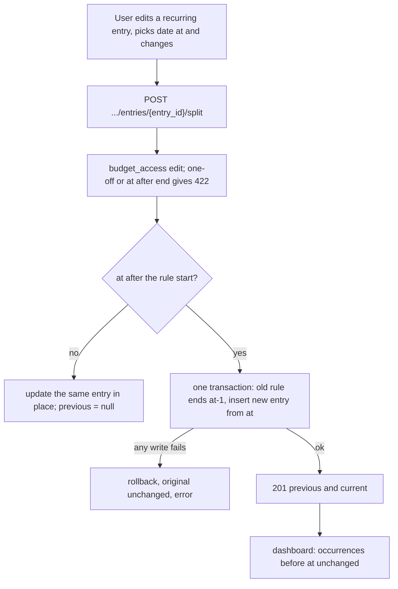
```mermaid
flowchart TD
    A["User edits a recurring entry, picks date at and changes"] --> B["POST .../entries/{entry_id}/split"]
    B --> C["budget_access edit; one-off or at after end gives 422"]
    C --> D{"at after the rule start?"}
    D -->|no| P["update the same entry in place; previous = null"]
    D -->|yes| E["one transaction: old rule ends at-1, insert new entry from at"]
    E -->|any write fails| F["rollback, original unchanged, error"]
    E -->|ok| G["201 previous and current"]
    G --> H["dashboard: occurrences before at unchanged"]
```

### US-06 Categories
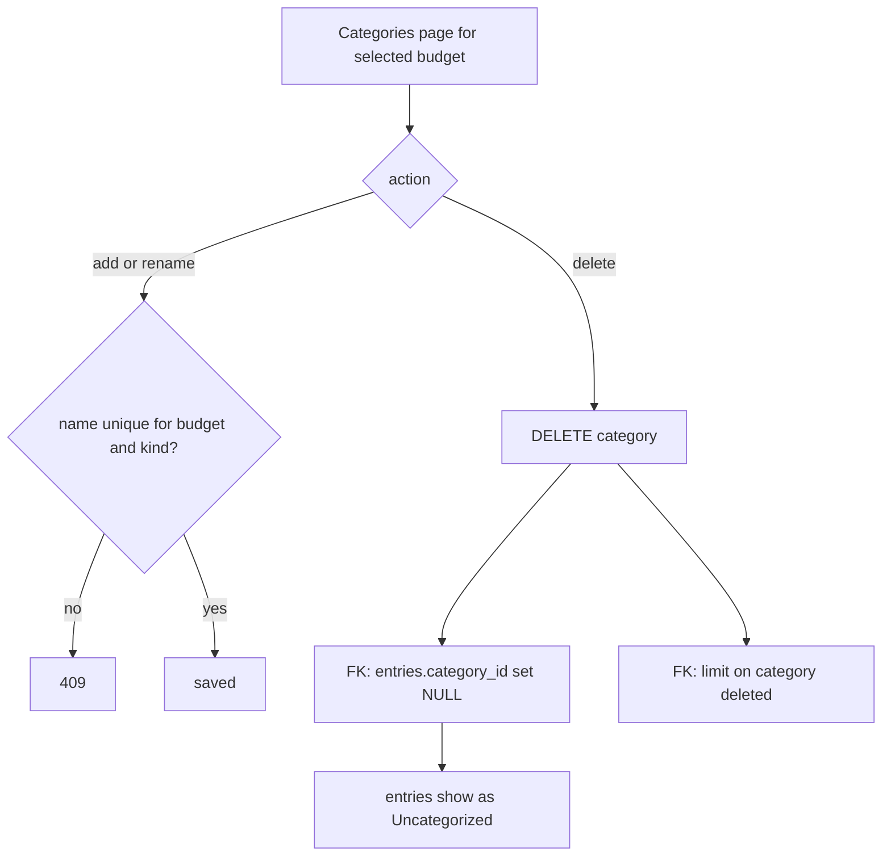
```mermaid
flowchart TD
    A["Categories page for selected budget"] --> B{"action"}
    B -->|add or rename| C{"name unique for budget and kind?"}
    C -->|no| X["409"]
    C -->|yes| D["saved"]
    B -->|delete| E["DELETE category"]
    E --> F["FK: entries.category_id set NULL"]
    E --> G["FK: limit on category deleted"]
    F --> H["entries show as Uncategorized"]
```

### US-14 Switch budgets and roles
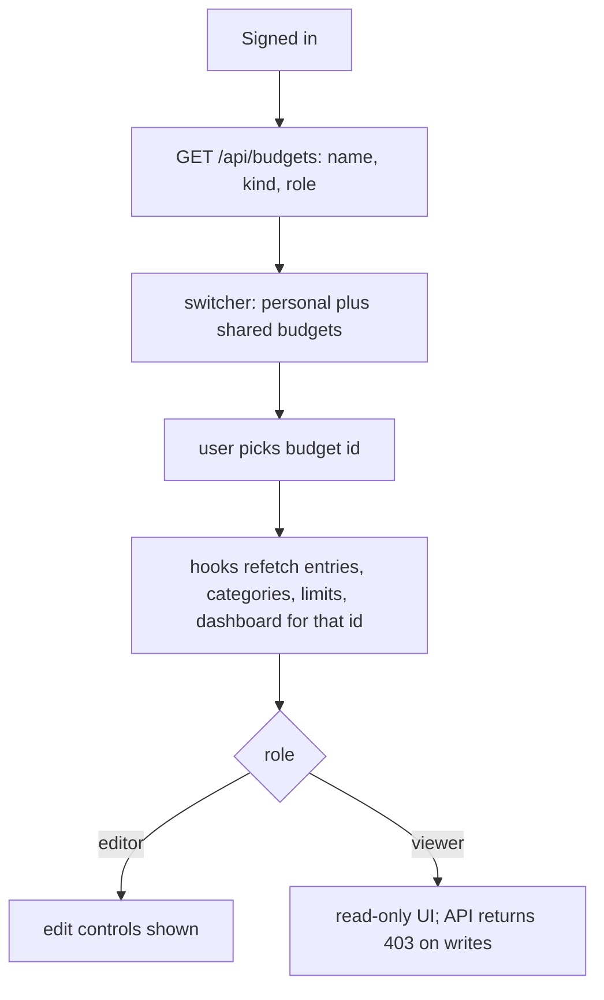
```mermaid
flowchart TD
    A["Signed in"] --> B["GET /api/budgets: name, kind, role"]
    B --> C["switcher: personal plus shared budgets"]
    C --> D["user picks budget id"]
    D --> E["hooks refetch entries, categories, limits, dashboard for that id"]
    E --> F{"role"}
    F -->|editor| G["edit controls shown"]
    F -->|viewer| H["read-only UI; API returns 403 on writes"]
```

### US-08 Period picker
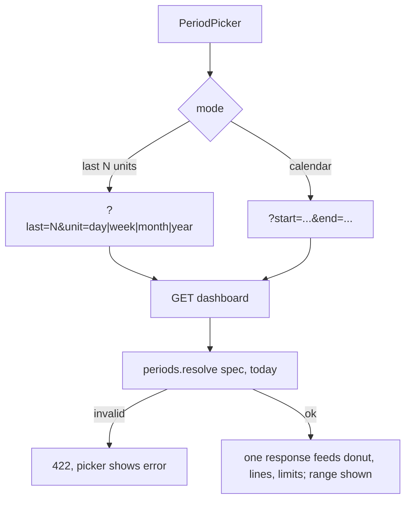
```mermaid
flowchart TD
    A["PeriodPicker"] --> B{"mode"}
    B -->|last N units| C["?last=N&unit=day|week|month|year"]
    B -->|calendar| D["?start=...&end=..."]
    C --> E["GET dashboard"]
    D --> E
    E --> F["periods.resolve spec, today"]
    F -->|invalid| X["422, picker shows error"]
    F -->|ok| G["one response feeds donut, lines, limits; range shown"]
```

### US-09 Donut chart
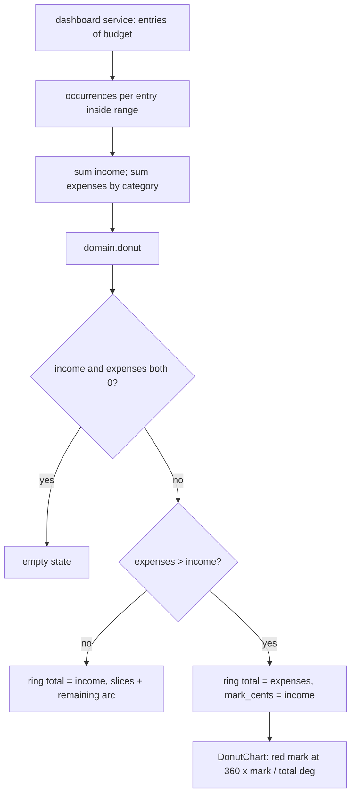
```mermaid
flowchart TD
    A["dashboard service: entries of budget"] --> B["occurrences per entry inside range"]
    B --> C["sum income; sum expenses by category"]
    C --> D["domain.donut"]
    D --> E{"income and expenses both 0?"}
    E -->|yes| F["empty state"]
    E -->|no| G{"expenses > income?"}
    G -->|no| H["ring total = income, slices + remaining arc"]
    G -->|yes| I["ring total = expenses, mark_cents = income"]
    I --> J["DonutChart: red mark at 360 x mark / total deg"]
```

### US-10 Line chart
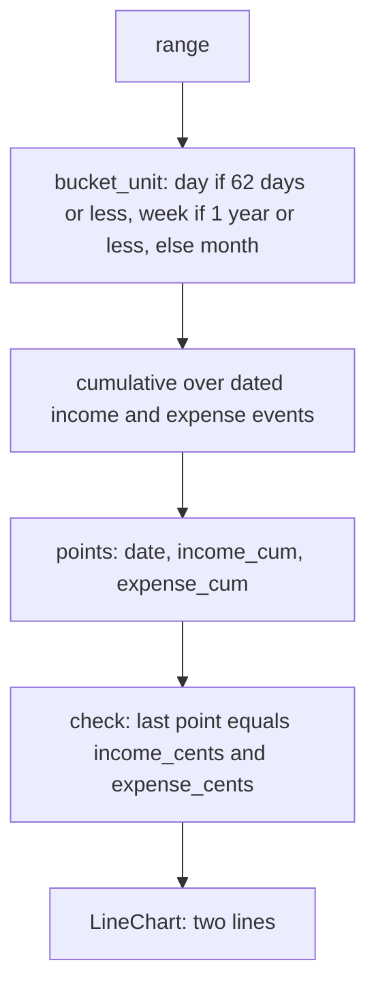
```mermaid
flowchart TD
    A["range"] --> B["bucket_unit: day if 62 days or less, week if 1 year or less, else month"]
    B --> C["cumulative over dated income and expense events"]
    C --> D["points: date, income_cum, expense_cum"]
    D --> E["check: last point equals income_cents and expense_cents"]
    E --> F["LineChart: two lines"]
```

### US-07 Limits
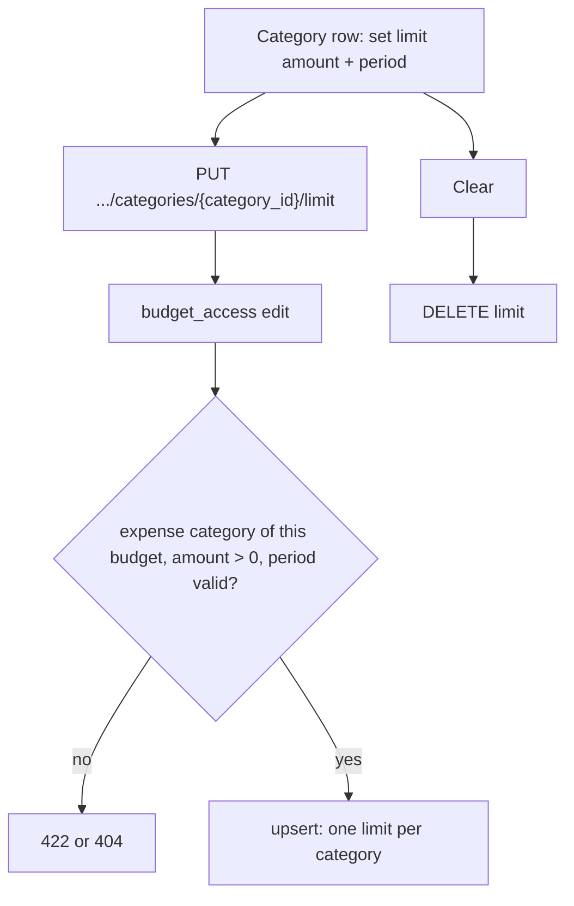
```mermaid
flowchart TD
    A["Category row: set limit amount + period"] --> B["PUT .../categories/{category_id}/limit"]
    B --> C["budget_access edit"]
    C --> D{"expense category of this budget, amount > 0, period valid?"}
    D -->|no| X["422 or 404"]
    D -->|yes| E["upsert: one limit per category"]
    A --> F["Clear"] --> G["DELETE limit"]
```

### US-11 Limit status on the dashboard
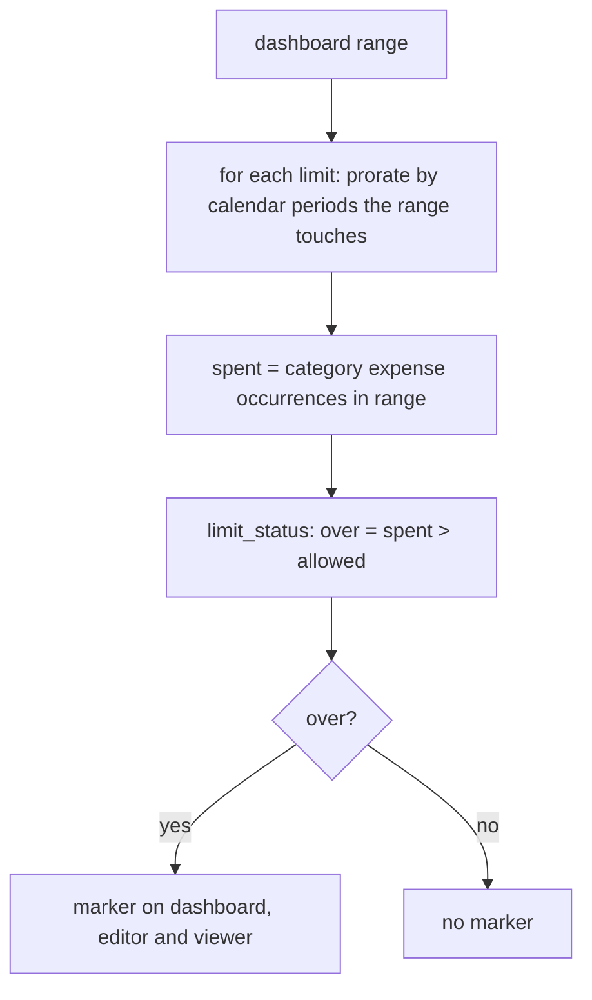
```mermaid
flowchart TD
    A["dashboard range"] --> B["for each limit: prorate by calendar periods the range touches"]
    B --> C["spent = category expense occurrences in range"]
    C --> D["limit_status: over = spent > allowed"]
    D --> E{"over?"}
    E -->|yes| F["marker on dashboard, editor and viewer"]
    E -->|no| G["no marker"]
```

### US-17 Over-limit warning on the expense form
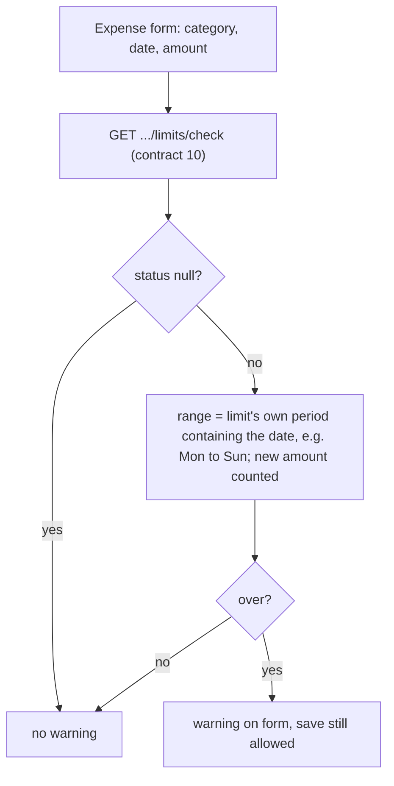
```mermaid
flowchart TD
    A["Expense form: category, date, amount"] --> B["GET .../limits/check (contract 10)"]
    B --> S{"status null?"}
    S -->|yes| Z["no warning"]
    S -->|no| D["range = limit's own period containing the date, e.g. Mon to Sun; new amount counted"]
    D --> E{"over?"}
    E -->|yes| F["warning on form, save still allowed"]
    E -->|no| Z
```

### US-12 Create a shared budget
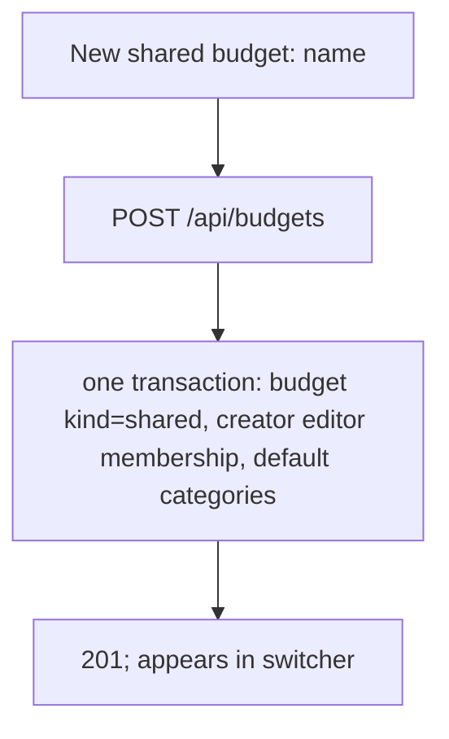
```mermaid
flowchart TD
    A["New shared budget: name"] --> B["POST /api/budgets"]
    B --> C["one transaction: budget kind=shared, creator editor membership, default categories"]
    C --> D["201; appears in switcher"]
```

### US-13 Invite by email
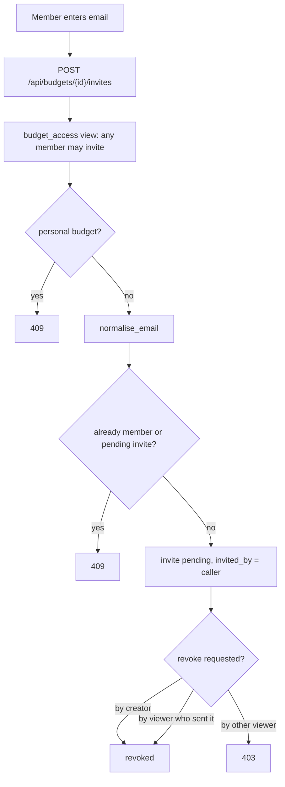
```mermaid
flowchart TD
    A["Member enters email"] --> B["POST /api/budgets/{id}/invites"]
    B --> C["budget_access view: any member may invite"]
    C --> D{"personal budget?"}
    D -->|yes| X1["409"]
    D -->|no| E["normalise_email"]
    E --> F{"already member or pending invite?"}
    F -->|yes| X2["409"]
    F -->|no| G["invite pending, invited_by = caller"]
    G --> H{"revoke requested?"}
    H -->|by creator| I["revoked"]
    H -->|by viewer who sent it| I
    H -->|by other viewer| X3["403"]
```

### US-18 Accept or decline an invite
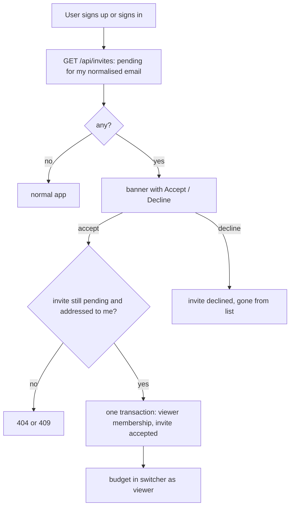
```mermaid
flowchart TD
    A["User signs up or signs in"] --> B["GET /api/invites: pending for my normalised email"]
    B --> C{"any?"}
    C -->|no| Z["normal app"]
    C -->|yes| D["banner with Accept / Decline"]
    D -->|accept| E{"invite still pending and addressed to me?"}
    E -->|no| X["404 or 409"]
    E -->|yes| F["one transaction: viewer membership, invite accepted"]
    F --> G["budget in switcher as viewer"]
    D -->|decline| H["invite declined, gone from list"]
```

### US-19 Leave or delete a shared budget
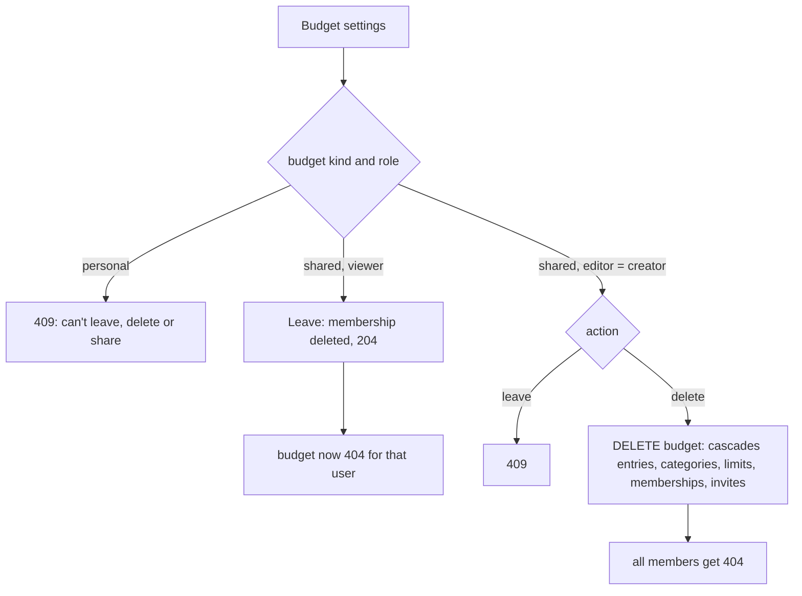
```mermaid
flowchart TD
    A["Budget settings"] --> B{"budget kind and role"}
    B -->|personal| X["409: can't leave, delete or share"]
    B -->|shared, viewer| C["Leave: membership deleted, 204"]
    C --> D["budget now 404 for that user"]
    B -->|shared, editor = creator| E{"action"}
    E -->|leave| X2["409"]
    E -->|delete| F["DELETE budget: cascades entries, categories, limits, memberships, invites"]
    F --> G["all members get 404"]
```

### US-15 Several made-up accounts at once
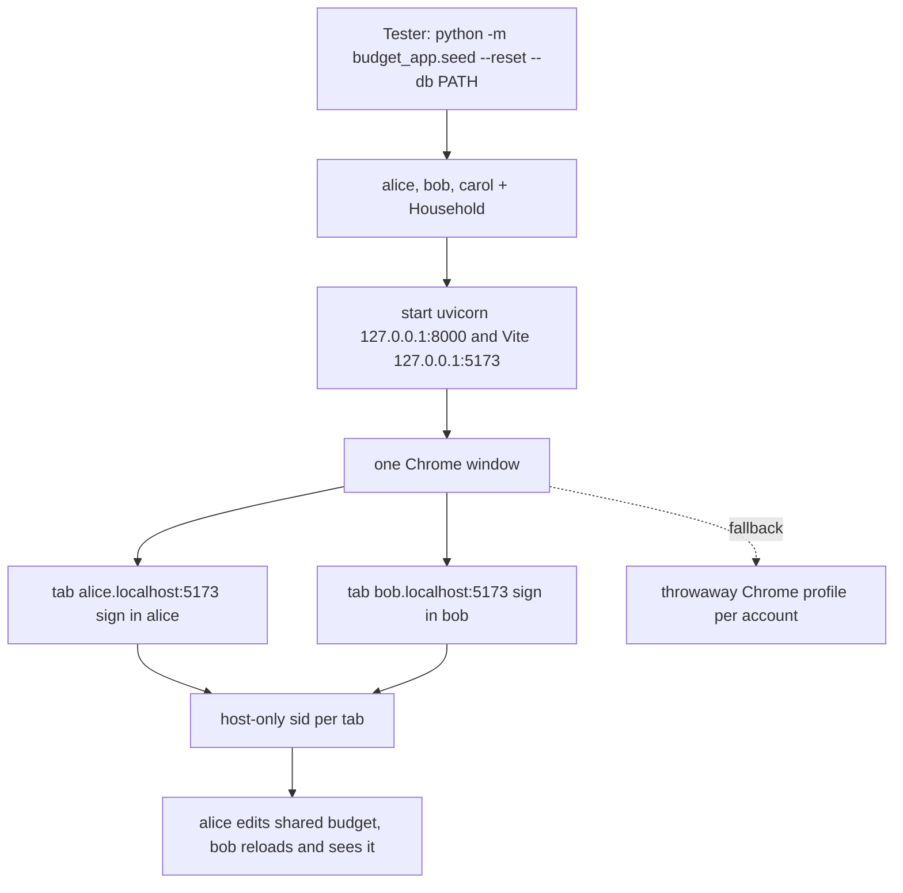
```mermaid
flowchart TD
    A["Tester: python -m budget_app.seed --reset --db PATH"] --> B["alice, bob, carol + Household"]
    B --> C["start uvicorn 127.0.0.1:8000 and Vite 127.0.0.1:5173"]
    C --> D["one Chrome window"]
    D --> E["tab alice.localhost:5173 sign in alice"]
    D --> F["tab bob.localhost:5173 sign in bob"]
    E --> G["host-only sid per tab"]
    F --> G
    G --> H["alice edits shared budget, bob reloads and sees it"]
    D -.->|"fallback"| I["throwaway Chrome profile per account"]
```

## 6. Story to architecture map

| Story | domain | db / repos | auth | services | api | web |
| --- | --- | --- | --- | --- | --- | --- |
| US-01 | accounts | users, budgets, members, categories | passwords, sessions | accounts | signup | sign-up page |
| US-02 | | sessions | sessions | accounts | signin, signout, me, `current_user` | sign-in page, 401 handling in client |
| US-03 | | every repo takes `BudgetAccess` | | | `budget_access`, OpenAPI walk test | |
| US-04, US-05 | recurrence (validation) | entries, categories | | entries | entries router | entry lists and forms, money input |
| US-16 | recurrence `split`, `occurrences` | entries (one transaction) | | entries | split route, one-off `PUT` | edit-from-date dialog |
| US-06 | | categories, FK SET NULL | | budgets | categories router | categories page |
| US-08 | periods | | | dashboard | period query schema | `PeriodPicker` |
| US-09 | dashboard `donut` | entries | | dashboard | dashboard route | `DonutChart` |
| US-10 | dashboard `bucket_unit`, `cumulative` | entries | | dashboard | dashboard route | `LineChart` |
| US-07 | limits | limits | | budgets or limits | limits routes | limit fields on categories page |
| US-11 | limits `prorate`, `limit_status` | limits, entries | | dashboard | dashboard `limits` | dashboard markers |
| US-17 | limits `period_containing`, `limit_status` | limits, entries | | limits `check` | `GET .../limits/check` | `useLimitCheck`, entry-form warning |
| US-12 | | budgets, members, categories | | sharing | budgets router | create-budget dialog |
| US-13 | accounts `normalise_email` | invites | | sharing | invites routes | invite form and list |
| US-18 | accounts | invites, members | | sharing | `/api/invites` routes | pending-invite banner |
| US-14 | | budgets, members | | budgets | budgets list, role in `BudgetAccess` | switcher, read-only mode |
| US-19 | | budgets (cascade), members | | sharing | leave, delete routes | budget settings |
| US-15 | | all | passwords | | | `vite.config.ts` hosts; README |

## 7. Deployment and what it needs (00-context.md)

- **Where:** only on this Mac. Nothing is deployed and there is no public URL. Merging into dev or uat deploys nothing; those branches only run CI.
- **Processes:**
  - API: `.venv/bin/uvicorn --host 127.0.0.1 --port 8000` on a small entry point that resolves the database path (`BUDGET_DB`, else the default) and calls `create_app(db_path)`.
  - Web: `npm run dev` in `web/` (Vite on `127.0.0.1:5173`, `strictPort`).
  - Both bind to loopback only.
- **Database:** `~/Library/Application Support/budget-app/budget.sqlite3`, with the folder created on first start; `BUDGET_DB` overrides it. Tests and the end-to-end run always use a temporary file.
- **Needs on this Mac:** Homebrew `python3.12` (3.12.16, SQLite 3.54.1), Node 26 and npm 11, and Google Chrome. Ports 8000 and 5173 must be free (5000 and 7000 are held by AirPlay). No secrets, `.env`, external services or spending.
- **Pinned versions (S5-a):**
  - Python: fastapi 0.165.0, pydantic 2.14.4, uvicorn 0.54.0, pwdlib[argon2] 0.4.2 (argon2-cffi 25.1.0); dev: pytest 9.2.0, httpx, ruff.
  - Web: react 19.3.1, vite 8.3.8, recharts 3.11.1, vitest 5.1.1, @playwright/test 1.65.1, and openapi-typescript (not yet installed in any spike; see section 11).
  - No SQLAlchemy, Alembic or dateutil at runtime.
- **Repo and CI:** remote `gacuchac/simple-budgeting`; `gacuchacbot` opens PRs into dev; the user merges into main. `tests.yml` keeps the Python job, now installing `requirements.txt` and `requirements-dev.txt`, and gains the `web` job.

## 8. Tasks (for `/build`), in the user's build order

Each task goes through the build loop as one branch and one PR into dev. It is decomposed only once every task it depends on is merged. Ids are task ids (`budget-app/<id>`, branch `feature/<id>`). Tasks that touch auth, the guard, a migration or the session go through the full lane (loop.md 4).

| Task | Title | Phase | Stories | Depends on |
| --- | --- | --- | --- | --- |
| bud-01 | Scaffold, database and Python CI | 1 Personal | foundation (US-03 cascade, US-06 SET NULL) | none |
| bud-02 | Domain core: money, accounts, recurrence | 1 Personal | US-01, US-16 | none |
| bud-03 | Accounts and sessions API | 1 Personal | US-01, US-02, US-14 (list) | bud-01, bud-02 |
| bud-04 | Budget guard and categories API | 1 Personal | US-03, US-06 | bud-03 |
| bud-05 | Entries API with split from a date | 1 Personal | US-04, US-05, US-16 | bud-04 |
| bud-06 | Web foundation, generated types and sign-in | 1 Personal | US-01, US-02, US-14 (switcher) | bud-03 |
| bud-07 | Web entries and categories | 1 Personal | US-04, US-05, US-06, US-16 | bud-05, bud-06 |
| bud-08 | Dashboard API | 2 Dashboard | US-08, US-09, US-10 | bud-05 |
| bud-09 | Dashboard web: period picker, donut, line chart | 2 Dashboard | US-08, US-09, US-10 | bud-08, bud-07 |
| bud-10 | Limits API and limit status | 3 Limits | US-07, US-11, US-17 | bud-08 |
| bud-11 | Limits web: limits, dashboard markers, form warning | 3 Limits | US-07, US-11, US-17 | bud-10, bud-09 |
| bud-12 | Shared budgets and invites API | 4 Sharing | US-12, US-13, US-18 | bud-10 |
| bud-13 | Leave, delete and the full role matrix | 4 Sharing | US-19, US-03, US-14 | bud-12 |
| bud-14 | Sharing web | 4 Sharing | US-12, US-13, US-14, US-18, US-19 | bud-13, bud-11 |
| bud-15 | Seed, two-account end-to-end run and run guide | 4 Sharing | US-15, definition of done | bud-14 |

```mermaid
flowchart LR
    b01["bud-01 scaffold+db"] --> b03["bud-03 accounts API"]
    b02["bud-02 domain core"] --> b03
    b03 --> b04["bud-04 guard+categories"]
    b04 --> b05["bud-05 entries+split"]
    b03 --> b06["bud-06 web foundation"]
    b05 --> b07["bud-07 web entries"]
    b06 --> b07
    b05 --> b08["bud-08 dashboard API"]
    b08 --> b09["bud-09 dashboard web"]
    b07 --> b09
    b08 --> b10["bud-10 limits API"]
    b10 --> b11["bud-11 limits web"]
    b09 --> b11
    b10 --> b12["bud-12 sharing API"]
    b12 --> b13["bud-13 leave/delete+matrix"]
    b13 --> b14["bud-14 sharing web"]
    b11 --> b14
    b14 --> b15["bud-15 seed+e2e+guide"]
```

These can run in parallel: bud-01 and bud-02; bud-04/bud-05 and bud-06; bud-08 and bud-07; bud-12 and bud-11.

### bud-01 Scaffold, database and Python CI
- **Delivers:**
  - `requirements.txt` and `requirements-dev.txt` pinned (section 7); `.venv` from `/opt/homebrew/bin/python3.12`; the `budget_app/` package skeleton.
  - `db/connection.py` `connect(path)` with the three PRAGMAs, and the default-path resolver (`BUDGET_DB` or Application Support, creating the folder).
  - `db/migrate.py` `migrate(conn) -> int`, and `0001_core.sql`: users, sessions, budgets, memberships, categories and entries (section 3.6).
  - CI's Python job installs both requirement files.
- **Done when:**
  - every connection reports `foreign_keys=1`, `journal_mode=wal` and `busy_timeout=5000`;
  - a fresh migration and an incremental one give the same `sqlite_master`, and rerunning applies nothing;
  - the **schema test** finds every `ON DELETE` and `CHECK` in `sqlite_master` after all migrations;
  - deleting a category sets its entries to NULL, and deleting a budget leaves zero orphans;
  - 2 threads x 20 writes all commit;
  - the default path is outside the repo, and `git status` stays clean.
- **Promoted from:** `spikes/sqlite/rawdb.py`, `test_s7b_raw.py`.

### bud-02 Domain core
- **Delivers:**
  - `domain/money.py`;
  - `domain/accounts.py` (`normalise_email`, `password_problems`);
  - `domain/recurrence.py` (`Rule` shapes, `occurrences`, `split`).
- **Done when:**
  - the 17-case recurrence golden table passes, including day-31 clamping across all 12 months, Feb 29 2028, both range edges and "a split keeps the past";
  - the email table accepts the 7 made-up forms and rejects the 5 bad ones;
  - the password table matches M6;
  - an rrule cross-check may stay in the tests only.
- **Promoted from:** `spikes/domain/domain.py`, `fixtures.py`, `golden.json`.

### bud-03 Accounts and sessions API
- **Delivers:**
  - `auth/passwords.py` and `auth/sessions.py`;
  - repos `users`, `sessions`, `budgets`, `members` and `categories` (default seeding);
  - `services/accounts.py`;
  - `api/app.py` `create_app(db_path)`, the run entry point and `current_user`;
  - routes `POST /api/signup`, `/api/signin`, `/api/signout`, `GET /api/me` and `GET /api/budgets`.
- **Done when:** every US-01 and US-02 criterion passes, including the session-revocation replay, the hash-only `sessions` table, survival across `create_app` on the same file, and the 401 walk.

### bud-04 Budget guard and categories API
- **Delivers:**
  - `api/deps.py` `budget_access(need)` returning `BudgetAccess`;
  - the categories repo taking `BudgetAccess`;
  - category routes under `/api/budgets/{budget_id}/categories` (list, add, rename, delete).
- **Done when:**
  - the OpenAPI guard walk passes, and fails when an unguarded budget route is added;
  - a non-member gets 404, and a viewer (membership inserted directly in the test) gets 403 on writes;
  - cross-budget ids return 404;
  - every US-06 criterion passes, except the limit-cascade line, which bud-10 adds.

### bud-05 Entries API with split from a date
- **Delivers:**
  - the entries repo and `services/entries.py`: create, list, update a one-off entry, delete, and split atomically;
  - routes under `/api/budgets/{budget_id}/entries`, including `PUT .../entries/{entry_id}` and `POST .../entries/{entry_id}/split` (contract 4).
- **Done when:** every US-04, US-05 and US-16 API criterion passes, including the injected-failure atomicity test and "totals before `at` unchanged". The guard walk still passes.

### bud-06 Web foundation, generated types and sign-in
- **Delivers:**
  - `web/` (Vite react-ts) with `.nvmrc` 26 and `vite.config.ts` (`host: '127.0.0.1'`, `port: 5173`, `strictPort: true`, proxy `/api` to `http://127.0.0.1:8000`);
  - a command that writes `openapi.json` from `create_app`, `openapi-typescript` to `src/api/schema.d.ts` (committed), and a CI staleness check;
  - `src/api/client.ts`, hooks, sign-up, sign-in and sign-out pages, the signed-in shell and the budget switcher;
  - CI's `web` job.
- **Done when:**
  - Vitest covers the client (a 401 sends the user to sign-in) and the hooks;
  - `npm run build` passes on CI under Node 26;
  - the staleness check fails on a deliberately stale `schema.d.ts`;
  - a config test asserts the Vite host, port and `strictPort`.

### bud-07 Web entries and categories
- **Delivers:**
  - income and expense lists and forms, with rule editors for one-off, every N units and day of month;
  - the money input (string to cents, no floats), the edit-from-date dialog that calls split, and delete;
  - the categories page;
  - everything scoped to the switcher's budget.
- **Done when:** Vitest covers the money parsing, the rule-form to `rule` JSON mapping for all three shapes, and the hooks for every write path.

### bud-08 Dashboard API
- **Delivers:**
  - `domain/periods.py` and `domain/dashboard.py` (`donut`, `bucket_unit`, `cumulative`);
  - `services/dashboard.py`;
  - `GET /api/budgets/{budget_id}/dashboard?<period>`, returning contract 7 with `limits: []` until bud-10.
- **Done when:**
  - every US-08 (API), US-09 (domain) and US-10 (domain) criterion passes;
  - the last cumulative point equals the totals;
  - the median build time for the A-1 fixture (50 rules, 2,000 one-offs, 5 years) is under 200 ms.

### bud-09 Dashboard web
- **Delivers:** `PeriodPicker`, `DonutChart` (Recharts, red mark at `mark_cents`), `LineChart`, the dashboard page, the empty states, stable category colours and USD formatting with `Intl.NumberFormat`.
- **Done when:**
  - Vitest checks the chart props and the mark angle (`360 x mark / total`);
  - a Playwright check in Chrome (`channel: 'chrome'`) renders the over, zero-income and empty fixtures with the mark at 270 deg and 0 deg (within 1 deg), 2 line paths, and no console errors or warnings.
- **Promoted from:** `spikes/charts/`.

### bud-10 Limits API and limit status
- **Delivers:**
  - migration `0002_limits.sql`;
  - `domain/limits.py` (`period_containing`, `prorate`, `limit_status`);
  - the limits repo, service and routes;
  - the dashboard's `limits` list filled;
  - `services/limits.check` and `GET /api/budgets/{budget_id}/limits/check` (contract 10), declared before any `/limits/{limit_id}` route.
- **Done when:**
  - every US-07, US-11 and US-17 API criterion passes, including the February and full-week pro-rating fixtures and the decision-2 example;
  - the schema test still passes with `0002`;
  - deleting a category deletes its limit;
  - a test calls `/limits/check` directly, proving the route order.

### bud-11 Limits web
- **Delivers:** limit fields on the categories page, over-limit markers on the dashboard, and the warning on the expense form through `useLimitCheck` (contract 10, decision 2).
- **Done when:** Vitest covers the marker shown only when `over` is true, and the form warning for the US-17 example ($60 warns, $40 doesn't, the next week isn't counted).

### bud-12 Shared budgets and invites API
- **Delivers:**
  - migration `0003_invites.sql`;
  - the invites and members repos, and `services/sharing.py`;
  - routes: `POST /api/budgets` (shared), `POST` and `GET /api/budgets/{budget_id}/invites`, revoke an invite, `GET /api/invites` (mine), and accept and decline.
- **Done when:** every US-12, US-13 and US-18 criterion passes, including the invite made before sign-up, the duplicate 409, personal 409, and revoke by creator vs viewer.
- **Note:** the accept and decline routes aren't under `/api/budgets/{budget_id}`, so the guard walk doesn't cover them. Their own tests check the addressee.

### bud-13 Leave, delete and the full role matrix
- **Delivers:** leave and delete routes, and the personal-budget restrictions.
- **Done when:**
  - US-19 passes;
  - the **role and isolation matrix** passes over every budget route found by the OpenAPI walk: editor, viewer and non-member, times every method, with expected codes 2xx, 403 or 404, plus cross-budget ids;
  - this matrix is the API half of the definition of done (decision 4).

### bud-14 Sharing web
- **Delivers:**
  - a create-shared-budget dialog and a switcher with roles;
  - a read-only mode for viewers;
  - the invite form, and the pending-invite list with revoke;
  - the pending-invite banner after sign-in, with Accept and Decline;
  - leave and delete, each with a confirmation.
- **Done when:** Vitest covers the read-only mode (no write controls for a viewer), the banner, and revoke shown only where it is allowed.

### bud-15 Seed, two-account end-to-end run and run guide
- **Delivers:**
  - `budget_app/seed.py` (US-15, with sample one-off and recurring entries);
  - a Playwright end-to-end test in `web/e2e/` that uses the installed Chrome and a temporary `BUDGET_DB`;
  - a README section on running the app, the `*.localhost` tabs and the throwaway-profile fallback.
- **The end-to-end run (decision 4), in one Chrome:**
  - sign up alice and bob, then sign them in on `alice.localhost:5173` and `bob.localhost:5173`;
  - alice creates a shared budget, adds an expense and invites bob;
  - bob sees the invite and accepts it;
  - bob sees the budget and alice's expense, and has no edit controls;
  - a write from bob's page is refused with 403;
  - each tab's `/api/me` shows its own email;
  - signing out in alice's tab makes her replayed `sid` return 401.
- **Done when:**
  - the seed passes its reset and refusal tests;
  - `npm run e2e` passes locally;
  - `lsof` shows only `127.0.0.1` listeners during the run.

### Regression checks to keep on every merge

The seam spikes become permanent tests, run in CI unless marked local:
- the OpenAPI guard walk (A-2);
- the schema test and the PRAGMA test (S7);
- the session replay after sign-out (S1);
- the argon2id hash prefix (S3);
- the email normaliser table (S4);
- the Vite host config test (S2, S6);
- the donut mark-angle check (S9): the Vitest part in CI, the Playwright part local;
- both CI jobs (S10);
- the bud-15 end-to-end run: local, before promoting dev to uat.

## 9. Definition of done (decision 4)

The first version is done when:
1. **API tests cover every role and isolation case.** The bud-13 matrix runs editor, viewer and non-member over every route under `/api/budgets/{budget_id}` (found by the OpenAPI walk) and every method, plus cross-budget ids. It also covers the routes outside the guard: invites, accept, decline, create a budget and the budget list. All of it passes in CI.
2. **One browser run.** The bud-15 Playwright run in the installed Chrome passes:
   - alice and bob are signed in at the same time on `alice.localhost` and `bob.localhost`;
   - alice invites bob, and bob accepts;
   - bob sees the shared budget and can't edit it.
3. Every acceptance criterion in section 4 has a passing test, and both CI jobs are green on dev.
4. All 15 tasks are merged into dev, qa has run the full suite on dev, and dev is promoted to uat.

## 10. Evals

**Evals: no.** The app has no LLM or agent behaviour (00-context.md: "No LLM or agent behaviour, so no eval cases").

## 11. Known risks (carried from 02-chosen.md section 5, plus the architecture's risks)

| Risk | Why it is still open | What would show it, and where |
| --- | --- | --- |
| A macOS firewall dialog appears when the servers start | The application firewall is off on this Mac, so the claim can't be falsified. Loopback-only binds are confirmed | If the firewall is turned on: start both servers and watch for the dialog. The bud-15 `lsof` check stays |
| Headed Chrome differs from the headless runs: a real quit and relaunch, incognito windows sharing one cookie jar, a real window on `alice.localhost` | Only headless Playwright with a persistent profile was run | The tester's first manual session after bud-15. The README states that a second incognito window is the same user |
| The user's own Chrome profile gets a `sid` from the throwaway-profile fallback | The default profile was not opened | Check `chrome://settings/cookies` for localhost after using the fallback |
| A `Secure` cookie on `*.localhost` | Not needed, since the chosen cookie has no `Secure` flag | n/a |
| Concurrent writes through HTTP (two sessions x 20 writes through uvicorn) | Tested only at the connection level, with two threads | Optional bud-13 test with two `TestClient` sessions on threads |
| Recharts mark placement at real dashboard sizes and on resize | Checked at one viewport (900x700) | bud-09 Playwright at two viewport sizes |
| CI's "Node.js 20 is deprecated" annotation on `checkout@v4`, `setup-python@v5` and `setup-node@v4` | The jobs pass because they are forced onto Node 24. Newer action majors were not tested | Watch the annotation on bud-01 and bud-06 PRs; bump the majors if a run fails |
| Node 24 locally (S5-c) and uv (S5-b) | Not needed, since S5-a held. Node 24 ran only on CI | n/a unless Homebrew moves Node |
| C-3 recompute in Chrome; B-5 full edit-to-visible time | Alternatives C and B were not chosen | n/a |
| `openapi-typescript` with FastAPI 0.165's OpenAPI 3.1 output on Node 26 (new, not in any spike) | The architecture requires generated types, but no spike installed or ran the generator | bud-06's first unit: generate `schema.d.ts`, check that `tsc` accepts it, and make the staleness check fail on a stale file |
| Generated types drift (architecture risk) | Only if the staleness check isn't there from the first web commit | bud-06 puts it in CI before any page code |
| A recurrence split that isn't atomic (architecture risk) | A crash between the two writes would leave overlapping rules | bud-05's injected-failure test |
| The limit check understates `spent_cents` while splitting a recurring entry, and counts a recurring expense once (contract 10, accepted for the POC) | `exclude_entry_id` drops all of the entry's occurrences in the period, including those before `at` | Only a form warning can be missed; the dashboard's `LimitStatus` is exact |
| `GET /limits/check` shadowed by a `/limits/{limit_id}` route (architecture risk) | FastAPI matches routes in declaration order | bud-10's direct route test |
| Dashboard speed reads every entry of a budget on each request (architecture risk) | 6.9 ms measured at the 5-year scale; fine for a POC | bud-08's 200 ms bound |

## 12. Confirmed defaults

OI-1 to OI-3 are settled by decisions 5 to 7 and are now contracts 4 and 10 in section 3.

Decision 8: the user kept every default ("it's ok").
- The over-limit warning on the form doesn't stop the expense being saved.
- For a recurring expense, the form checks the limit period containing the rule's start date.
- "Last N units" ends today and goes back N units (on 2026-11-24, `last=1&unit=month` is 2026-10-25 to 2026-11-24). The dashboard opens on the current calendar month.
- Weeks run Monday to Sunday, for limits (as in the M2-a spike) and for weekly buckets.
- One limit per category: setting a new one replaces the old.
- Declining sets the invite to `declined`. The same email can be invited again later, after a decline, a revoke or leaving.
- The creator can't remove a member; members leave themselves. Removing members is out of scope unless the user adds it.
- Entries have a `name` and no separate note field. Contract 3 has none, though step 1's US-05 mentioned an optional note.
- The Playwright run is local only, not in CI.
- The seed's sample entries are fixed: a monthly salary on the 5th, monthly rent, weekly groceries and a few one-offs. Its password for all three accounts is `Password1!`.

## 13. Out of scope

- Bank or card import, and multiple currencies. Entries are typed by hand, in USD only.
- Any deployment, hosting, public URL, DNS, TLS or remote database. It runs only on this Mac.
- Browsers other than Chrome (Safari, Firefox), mobile apps, offline mode and multi-device sync.
- Production hardening:
  - password reset, change of password or email, account deletion, email verification;
  - MFA, OAuth, rate limiting, lockout;
  - audit logs, encryption at rest, backups.
- Sending email or any notification. Invites and limit warnings appear only in the app.
- A "near limit" warning. Only "exceeded" is shown.
- More than one editor per shared budget, handing over the editor role, the creator removing members, and renaming roles.
- Sharing a personal budget.
- Editing or deleting a single occurrence of a recurring entry. Edits apply from a date onward, and deletes remove the series.
- Data export or import, savings goals, investments and forecasting.
- External services, APIs, LLMs and paid resources. No eval cases.
